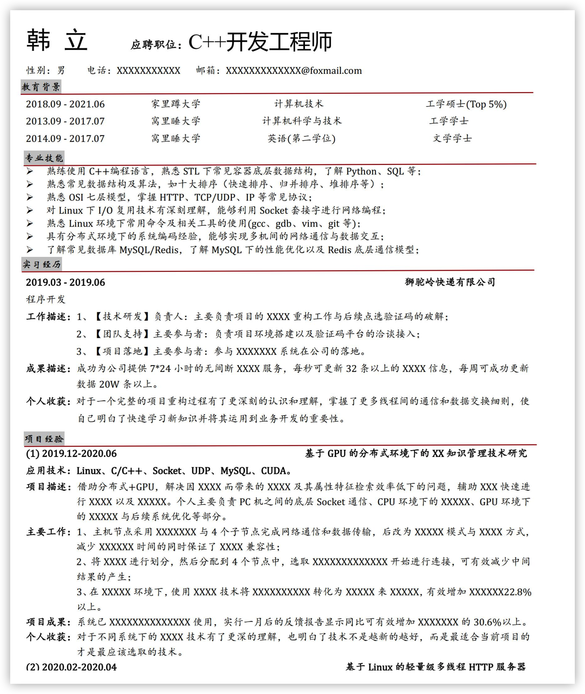
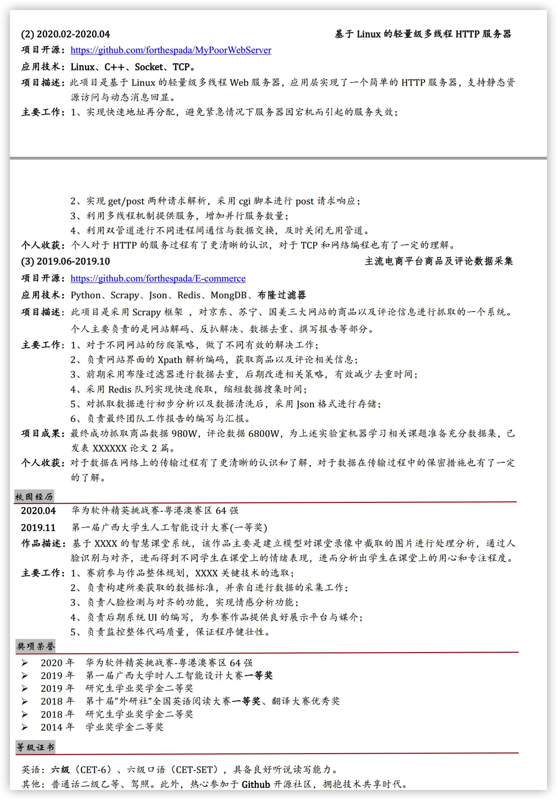
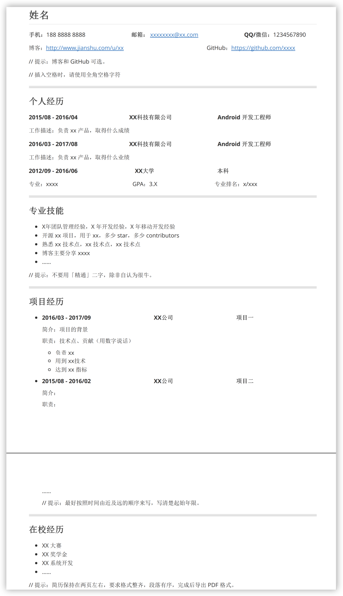
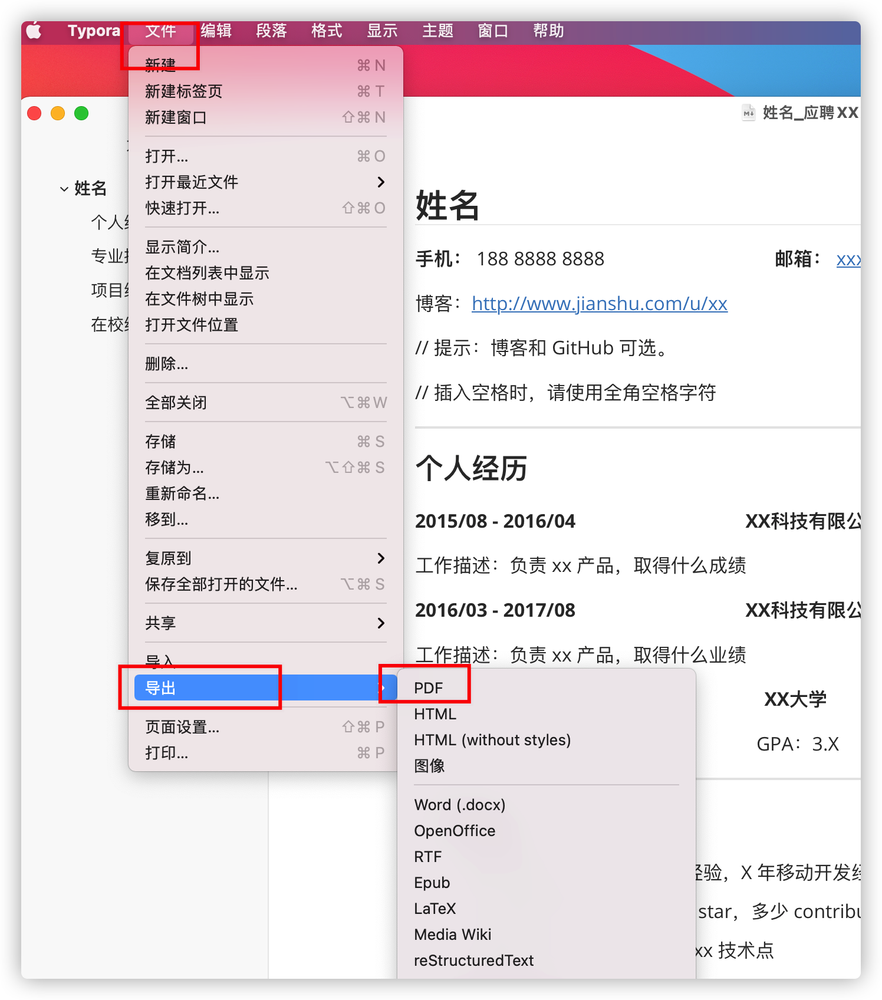

<h1 align="center">
  程序员简历
</h1>

看完1000多份简历后，我终于明白一份合格的计算机专业程序员简历应该是怎样的了

## 1、如何写好自己的简历

一份百投百中的简历是如何迭代26个版本的？（推荐阅读）：[点此直达](https://interviewguide.cn/notes/05-xiustar/03-resume/01-01-%E4%B8%80%E4%BB%BD%E7%99%BE%E6%8A%95%E7%99%BE%E4%B8%AD%E7%9A%84%E8%AE%A1%E7%AE%97%E6%9C%BA%E6%A0%A1%E6%8B%9B%E7%AE%80%E5%8E%86%E6%98%AF%E5%A6%82%E4%BD%95%E8%BF%AD%E4%BB%A3%E8%B6%B3%E8%B6%B326%E7%89%88%E7%9A%84.html)

从0教你写好一份属于自己的简历，如何写好自己的项目经历（推荐阅读）：[点此直达](https://interviewguide.cn/notes/05-xiustar/03-resume/01-04%E8%BF%99%E5%91%A8%E6%94%B9%E4%BA%8690%E5%A4%9A%E4%BB%BD%E7%AE%80%E5%8E%86.html)

## 2、经典程序员简历模板以及下载方式

### 简历模板

> 阿秀个人简历模板

> 感谢 [Trinea](https://github.com/Trinea) 的模板——[推荐两个技术简历模板](http://b.codekk.com/detail/Trinea/%E6%8E%A8%E8%8D%90%E4%B8%A4%E4%B8%AA%E6%8A%80%E6%9C%AF%E7%AE%80%E5%8E%86%E6%A8%A1%E6%9D%BF)

### 下载方式

上述两份简历的word和md版本，我都放在自己的公众号[拓跋阿秀](https://mp.weixin.qq.com/s/gRw25aRFBVB0lUhBAJqV5g)中了，后台回复：阿秀简历，即可获取。

  

解压密码直接告诉你就是a123654，无任何套路

## 3、如何导出PDF格式简历

### Word版本导出PDF简历步骤

### md文件导出PDF简历步骤

# 关于作者

你好，我是阿秀，普通双非学校出身，计算机学习基本全靠自学，校招时拿下百度、华为、农业银行、字节跳动SP等中大厂offer，现于字节跳动抖音部门担任全栈研发工程师，主后端、兼前端。

信奉持续学习、终生成长，毕业后机缘巧合下组建了一个计算机学习圈：[点此了解学习圈详情](https://interviewguide.cn/notes/05-xiustar/01-xiustar_reading_guide/01-introduce.html#%E9%98%BF%E7%A7%80%E7%BB%84%E5%BB%BA%E4%BA%86%E4%B8%80%E4%B8%AA%E6%A0%A1%E6%8B%9B%E5%AD%A6%E4%B9%A0%E5%9C%88%E5%AD%90)

如果你有计算机学习、转行、校招、求职等方面的困扰，也欢迎你与我交流，备注：「个人简单介绍」 + 交流，围观个人朋友圈，做点赞之交

  

# 个人公众号

持续个人学习&工作文章，微信搜索：「拓跋阿秀」第一时间围观，关注后回复：**宝贝**，真的会送你一个宝贝~。

**「拓跋阿秀」每天都会分享一篇计算机学习、校招、职场、大厂相关文章，帮你梳理计算机知识体系，轻松应对计算机校招求职！**，同时阿秀在学习计算机以来收集整理了大量的学习资源，包括但不限制于学习心得、校招总结、精品资源，更有很多学弟学妹在这里打卡学习。

没有什么成功是一蹴而就的，有的只是有些人在无声处默默，**来看看就知道了，我想你肯定会觉得相见恨晚的！**

  

